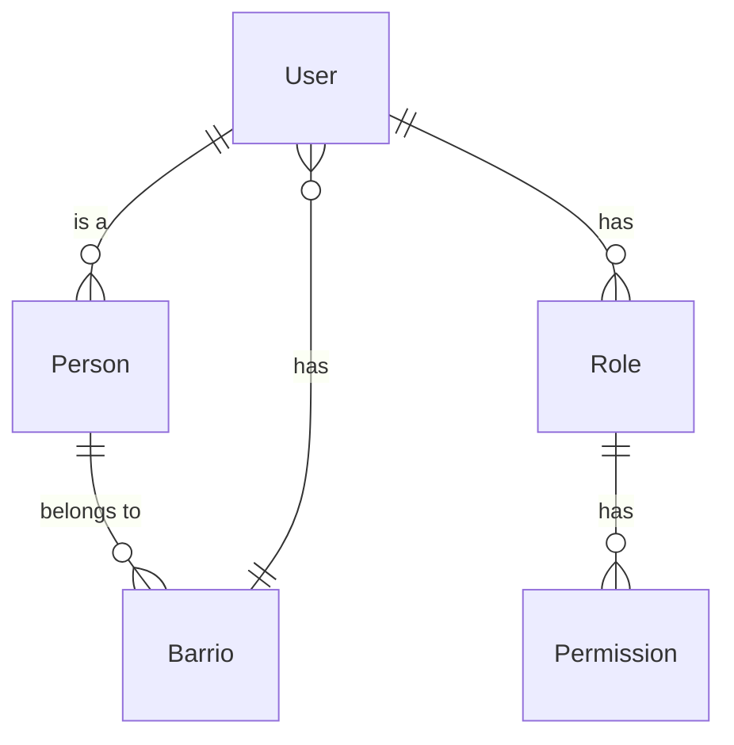

# Planificación Técnica del Sistema Web de Gestión de Personas para una Iglesia

## 1. Resumen del Proyecto y Stack Tecnológico Sugerido

**Stack Tecnológico Propuesto:**
- **Frontend:** Next.js
- **Backend:** Node.js con TypeScript
- **Base de Datos:** Prisma
- **Estilo:** Tailwind CSS
- **Autenticación:** Auth0 o Firebase Authentication
- **Control de Acceso:** Casl.js o similar para RBAC

**Razones de la Selección:**
- **Next.js:** Moderno framework React para desarrollo de aplicaciones web, con SSR y SSG.
- **TypeScript:** Orientado a objetos, seguro de tipos, y con un gran ecosistema de herramientas.
- **Prisma:** ORM de TypeScript que facilita la manipulación de la base de datos.
- **Tailwind CSS:** Framework CSS utility-first para estilos rápidos y personalizables.
- **Auth0/Firebase Authentication:** Servicios de autenticación robustos y escalables.
- **Casl.js:** Biblioteca para RBAC que permite definir y gestionar roles y permisos fácilmente.

## 2. Arquitectura de Software y Carpetas

**Estructura de Carpetas:**
```
/project-root
  /api
    /v1
      /person
        index.ts
      /barrio
        index.ts
      /role
        index.ts
      /permission
        index.ts
  /components
    /common
      Button.tsx
      Input.tsx
    /person
      PersonForm.tsx
      PersonList.tsx
    /barrio
      BarrioForm.tsx
      BarrioList.tsx
  /pages
    /api
      /v1
        person
          [id].ts
        barrio
          [id].ts
    /person
      index.tsx
    /barrio
      index.tsx
    /auth
      [signUp].tsx
      [signIn].tsx
  /styles
    globals.css
  /types
    person.d.ts
    barrio.d.ts
    role.d.ts
    permission.d.ts
  .env
  next.config.ts
  prisma
    schema.prisma
```

## 3. Diseño de la Base de Datos (Esquema Conceptual)

**Entidades y Relaciones:**
- **User:** Cuenta con email y password, puede estar vinculado a una Person.
- **Person:** Información detallada de la persona, con estado de Miembro.
- **Barrio:** Agrupación de Personas con Asistente de Familia.
- **Role:** Definición de roles disponibles en el sistema.
- **Permission:** Definición de permisos granulares.

**Diagrama ER:**


## 4. Matriz de Permisos (RBAC)

| Rol            | Permiso             | Descripción                                                                 |
|----------------|---------------------|----------------------------------------------------------------------------|
| Admin          | read:person         | Puede leer la información de las personas.                                   |
| Admin          | create:person       | Puede crear nuevas personas.                                               |
| Admin          | update:person       | Puede actualizar información de las personas.                               |
| Admin          | delete:person       | Puede eliminar personas (soft delete).                                       |
| BarrioAssistant| read:person         | Puede leer la información de las personas en su barrio.                   |
| BarrioAssistant| update:person       | Puede actualizar información de las personas en su barrio.                   |
| BarrioAssistant| delete:person       | Puede eliminar personas (soft delete) en su barrio.                          |
| BarrioAssistant| assign:assistant     | Puede asignar un Asistente de Familia a otro Barrio.                        |
| BarrioAssistant| read:barrio         | Puede leer la información de sus barrios.                                     |
| BarrioAssistant| update:barrio       | Puede actualizar la información de sus barrios.                               |
| BarrioAssistant| delete:barrio       | Puede eliminar sus barrios (soft delete).                                    |

## 5. Roadmap de Implementación (Fases)

**Fase 1: Inicialización del Repositorio y Esquemas**
- Crear el repositorio Git.
- Configurar Next.js y TypeScript.
- Configurar Prisma y crear esquemas iniciales para User, Person, Barrio, Role, y Permission.

**Fase 2: Implementación del Backend**
- Implementar CRUD operations para User, Person, Barrio, Role, y Permission.
- Implementar autenticación con Auth0/Firebase Authentication.
- Implementar RBAC con Casl.js.

**Fase 3: Implementación del Frontend**
- Crear componentes reutilizables como Button, Input, etc.
- Implementar la UI para Person y Barrio.
- Implementar la lógica de negocio para gestionar la asignación de Asistentes de Familia.

**Fase 4: Pruebas y Refinamiento**
- Realizar pruebas unitarias y e2e.
- Refinar la UI y la experiencia del usuario.
- Documentar el código y configuraciones.

**Fase 5: Entrega de la UI Final**
- Entregar la UI final a los stakeholders.
- Realizar la configuración final de Auth0/Firebase Authentication.
- Realizar la configuración final de RBAC.
- Preparar el proyecto para producción.